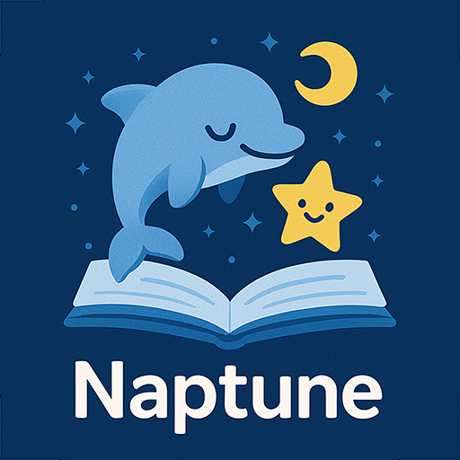
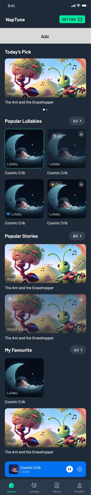
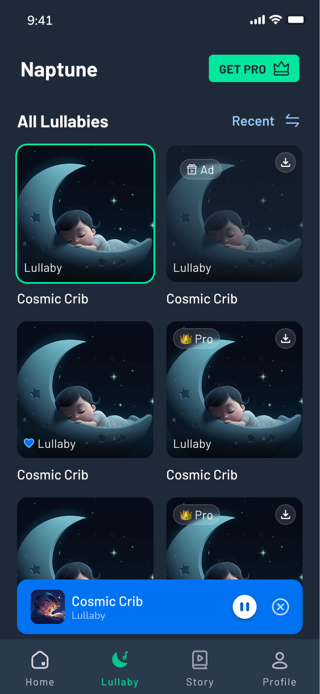
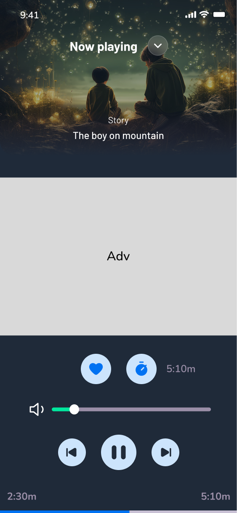
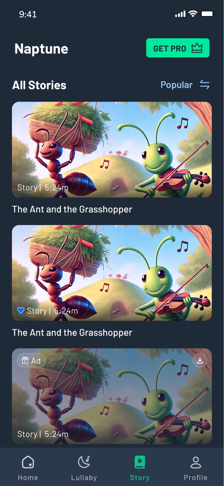
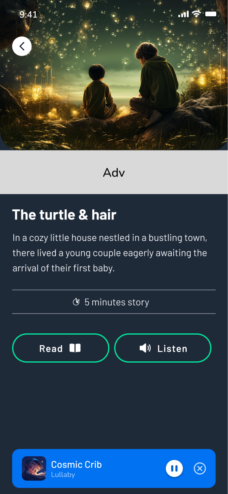
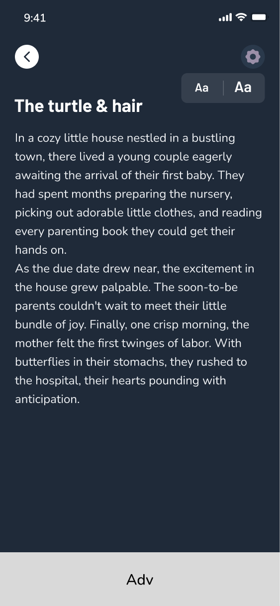
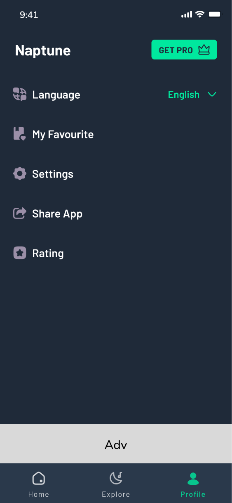

<p align="center">
  
</p>

<h1 align="center">Naptune - Lullaby & Bedtime Stories</h1>

<p align="center">
  <strong>A modern Android application for children's sleep assistance</strong>
</p>

<p align="center">
  
  
  
  
  
</p>

---

## Overview

**Naptune** is a production-ready Android application that helps children fall asleep with soothing lullabies and bedtime stories. **Lullabies can be downloaded for offline playback**, while **stories are streamed online** for the best experience. Built with modern Android development practices following **SOLID principles**, this project demonstrates expertise in Clean Architecture, MVI pattern, and comprehensive feature implementation including offline support, multi-language localization, and monetization.

---

## Screenshots

<table>
<tr>
    <td align="center"><b>Home Screen</b></td>
    <td align="center"><b>Lullaby Collection</b></td>
    <td align="center"><b>Audio Player</b></td>
  </tr>
  <tr>
    <td></td>
    <td></td>
    <td></td>
  </tr>

<tr style="height: 40px;">
    <td colspan="3" style="border-top: none; border-bottom: none;"></td>
 </tr>

   <tr>
    <td align="center" style="padding-top: 20px;"><b>Bedtime Stories</b></td>
    <td align="center" style="padding-top: 20px;"><b>Story Manager</b></td>
    <td align="center" style="padding-top: 20px;"><b>Story Reader</b></td>
  </tr>

  <tr>
    <td></td>
    <td></td>
    <td></td>
  </tr>

  <tr style="height: 40px;">
    <td colspan="3" style="border-top: none; border-bottom: none;"></td>
 </tr>

  <tr>
    <td colspan="3" align="center" style="padding-top: 20px;"><b>Profile & Settings</b></td>
  </tr>

  <tr>
    <td colspan="3" align="center"></td>
  </tr>

</table>

---

## Tech Stack

| Category                 | Technology                                   |
| ------------------------ | -------------------------------------------- |
| **Language**             | Kotlin 100%                                  |
| **UI Framework**         | Jetpack Compose with Material 3              |
| **Architecture**         | Clean Architecture + MVI (Model-View-Intent) |
| **Dependency Injection** | Hilt (Dagger)                                |
| **Local Database**       | Room Database                                |
| **Preferences**          | DataStore                                    |
| **Backend**              | Appwrite (BaaS)                              |
| **Networking**           | Retrofit 3.0, OkHttp                         |
| **Media Playback**       | Media3 ExoPlayer                             |
| **Async Operations**     | Kotlin Coroutines, Flow, StateFlow           |
| **Image Loading**        | Coil                                         |
| **Push Notifications**   | Firebase Cloud Messaging (FCM)               |
| **Monetization**         | Google Play Billing, AdMob                   |
| **Build System**         | Gradle with Kotlin DSL                       |
| **Code Processing**      | KSP (Kotlin Symbol Processing)               |

---

## Architecture

This project follows **Clean Architecture** principles with **MVI (Model-View-Intent)** pattern for the presentation layer, ensuring separation of concerns, testability, and scalability.

```
┌─────────────────────────────────────────────────────────────────────────┐
│                         PRESENTATION LAYER                               │
│  ┌───────────────┐    ┌───────────────┐    ┌───────────────────────┐   │
│  │    Screen     │ -> │    Intent     │ -> │      ViewModel        │   │
│  │   (Compose)   │    │   (Actions)   │    │   (State Management)  │   │
│  └───────────────┘    └───────────────┘    └───────────────────────┘   │
│                                                       │                 │
│                                                       v                 │
│                                            ┌───────────────────────┐   │
│                                            │       UiState         │   │
│                                            │   (Immutable State)   │   │
│                                            └───────────────────────┘   │
├─────────────────────────────────────────────────────────────────────────┤
│                           DOMAIN LAYER                                   │
│  ┌───────────────┐    ┌───────────────┐    ┌───────────────────────┐   │
│  │   Use Cases   │    │  Repository   │    │    Domain Models      │   │
│  │ (Business     │    │  Interfaces   │    │     (Entities)        │   │
│  │   Logic)      │    │               │    │                       │   │
│  └───────────────┘    └───────────────┘    └───────────────────────┘   │
├─────────────────────────────────────────────────────────────────────────┤
│                            DATA LAYER                                    │
│  ┌─────────────┐  ┌─────────────┐  ┌─────────────┐  ┌─────────────┐    │
│  │    Room     │  │  DataStore  │  │  Appwrite   │  │  Retrofit   │    │
│  │  Database   │  │ Preferences │  │   (BaaS)    │  │ (FCM API)   │    │
│  └─────────────┘  └─────────────┘  └─────────────┘  └─────────────┘    │
│  ┌─────────────────────────────────────────────────────────────────┐   │
│  │              Repository Implementations & Data Sources           │   │
│  └─────────────────────────────────────────────────────────────────┘   │
└─────────────────────────────────────────────────────────────────────────┘
```

### Data Flow

```
User Action → Intent → ViewModel → UseCase → Repository → DataSource → DB/API
                                                              ↓
                    UI ← UiState ← ViewModel ← Flow<Data> ← Repository
```

---

## Project Structure

```
app/src/main/java/com/naptune/lullabyandstory/
│
├── data/                           # Data Layer
│   ├── billing/                    # Google Play Billing integration
│   ├── datastore/                  # DataStore preferences
│   ├── fcm/                        # Firebase Cloud Messaging
│   ├── local/                      # Room database
│   │   ├── dao/                    # Data Access Objects
│   │   ├── database/               # Database configuration
│   │   └── entity/                 # Database entities
│   ├── manager/                    # Session & state managers
│   ├── mapper/                     # Data ↔ Domain mappers
│   ├── model/                      # Remote data models
│   ├── network/                    # Network data sources
│   │   ├── admob/                  # AdMob integration
│   │   ├── appwrite/               # Appwrite API
│   │   ├── fcm/                    # FCM REST API
│   │   └── prdownloader/           # File download manager
│   └── repository/                 # Repository implementations
│
├── di/                             # Dependency Injection
│   ├── AppModule.kt
│   ├── DatabaseModule.kt
│   ├── RepositoryModule.kt
│   ├── AdMobModule.kt
│   └── FcmModule.kt
│
├── domain/                         # Domain Layer
│   ├── data/                       # Domain data classes
│   ├── manager/                    # Domain managers
│   ├── model/                      # Domain models
│   ├── repository/                 # Repository interfaces
│   └── usecase/                    # Business logic
│       ├── admob/
│       ├── fcm/
│       ├── lullaby/
│       ├── story/
│       └── translation/
│
├── presentation/                   # Presentation Layer (MVI)
│   ├── components/                 # Reusable UI components
│   ├── explore/                    # Explore screen
│   ├── favourite/                  # Favourites screen
│   ├── lullaby/                    # Lullaby browsing
│   ├── main/                       # Home screen
│   ├── navigation/                 # Navigation setup
│   ├── player/                     # Audio player
│   │   ├── bottomsheet/            # Global player UI
│   │   ├── service/                # Background service
│   │   └── timermodal/             # Sleep timer
│   ├── premium/                    # Premium subscription
│   ├── profile/                    # User profile
│   ├── story/                      # Stories
│   │   ├── storymanager/
│   │   └── storyreader/
│   └── splash/                     # Splash screen
│
├── utils/                          # Utilities
├── MainActivity.kt
└── NaptuneApplication.kt           # @HiltAndroidApp
```

---

---

## SOLID Principles Implementation

This project demonstrates practical application of SOLID principles throughout the codebase:

### Single Responsibility Principle (SRP)
Each class has one clear responsibility:
- **Repositories**: Only handle data operations (fetching, storing)
- **UseCases**: Only contain business logic
- **ViewModels**: Only manage UI state
- **DataSources**: Only interact with specific data sources (API, Database, Preferences)

```kotlin
// Example: Each class has one job
class LullabyRepository          // Data operations only
class GetLullabiesUseCase        // Business logic only  
class LullabyViewModel           // UI state management only
```

### Open/Closed Principle (OCP)
Code is open for extension but closed for modification through interfaces:
```kotlin
interface LullabyRepository {
    fun getLullabies(): Flow<List<Lullaby>>
}

// Can extend without modifying existing code
class LullabyRepositoryImpl : LullabyRepository
class OfflineLullabyRepository : LullabyRepository
```

### Liskov Substitution Principle (LSP)
All implementations can replace their abstractions without breaking functionality:
```kotlin
// Any UseCase implementation works with the same interface
interface UseCase<Input, Output> {
    suspend operator fun invoke(input: Input): Output
}
```

### Interface Segregation Principle (ISP)
Interfaces are focused and clients don't depend on methods they don't use:
```kotlin
// Separate, focused interfaces
interface LullabyRepository { /* lullaby operations */ }
interface StoryRepository { /* story operations */ }
interface FavouriteRepository { /* favourite operations */ }
```

### Dependency Inversion Principle (DIP)
High-level modules depend on abstractions, not concrete implementations:
```kotlin
@HiltViewModel
class LullabyViewModel @Inject constructor(
    private val getLullabiesUseCase: GetLullabiesUseCase  // Depends on abstraction
) : ViewModel()

// Hilt provides the concrete implementation
@Module
abstract class RepositoryModule {
    @Binds
    abstract fun bindLullabyRepository(
        impl: LullabyRepositoryImpl
    ): LullabyRepository  // Returns interface, not implementation
}
```

## Features

### Core Features

| Feature                    | Description                                                        |
| -------------------------- |--------------------------------------------------------------------|
| 🎵 **Lullaby Playback**    | Download and play lullabies with loop mode for continuous playback |
| 📖 **Bedtime Stories**     | Audio narration with text reader mode                              |
| 🔊 **Background Playback** | MediaSessionService with notification controls                     |
| ⏰ **Sleep Timer**         | Auto-stop playback after configurable duration                     |
| 📥 **Offline Mode**        | Download content for offline access                                |
| ❤️ **Favourites**          | Save favourite items with LIFO ordering                            |

### Technical Features

| Feature                       | Implementation                                             |
| ----------------------------- | ---------------------------------------------------------- |
| 📱 **Adaptive UI**            | Supports multiple screen sizes and densities |
| 🌍 **Multi-Language Support** | 6 languages (EN, ES, FR, DE, PT, HI)                       |
| 🔄 **Reactive Data**          | StateFlow-based UI updates with Kotlin Flow                |
| 🔔 **Push Notifications**     | FCM with custom backend server                             |
| 💎 **Premium Subscriptions**  | Google Play Billing (Monthly, Yearly, Lifetime)            |
| 📺 **Ad Integration**         | Banner ads and rewarded video ads via AdMob                |
| 💾 **Smart Caching**          | 24-hour sync interval with parallel data fetching          |

---

## Key Implementation Highlights

### 1. MVI Pattern with Sealed Classes

```kotlin
// Intent - User Actions
sealed class LullabyIntent {
    object FetchLullabies : LullabyIntent()
    data class DownloadLullabyItem(val item: LullabyDomainModel) : LullabyIntent()
    data class ChangeCategory(val category: LullabyCategory) : LullabyIntent()
}

// State - UI State
sealed class LullabyUiState {
    object IsLoading : LullabyUiState()
    data class Content(
        val lullabies: List<LullabyDomainModel>,
        val filteredLullabies: List<LullabyDomainModel>,
        val downloadProgress: Map<String, Int>,
        val isPremium: Boolean
    ) : LullabyUiState()
    data class Error(val message: String) : LullabyUiState()
}

// ViewModel - State Management
@HiltViewModel
class LullabyViewModel @Inject constructor(
    private val fetchLullabiesUseCase: FetchLullabiesUseCase,
    private val billingManager: BillingManager
) : ViewModel() {

    val uiState: StateFlow<LullabyUiState> = combine(
        _baseState,
        billingManager.isPurchased
    ) { state, isPremium ->
        // Combine multiple state sources
    }.stateIn(viewModelScope, SharingStarted.WhileSubscribed(5000), LullabyUiState.IsLoading)

    fun handleIntent(intent: LullabyIntent) {
        when (intent) {
            is LullabyIntent.FetchLullabies -> fetchData()
            is LullabyIntent.DownloadLullabyItem -> download(intent.item)
            is LullabyIntent.ChangeCategory -> filterByCategory(intent.category)
        }
    }
}
```

### 2. Repository with Parallel Data Fetching

```kotlin
override suspend fun syncLullabiesFromRemote(): Flow<List<LullabyDomainModel>> = flow {
    if (appPreferences.isSyncNeeded() || localDataSource.isEmpty()) {
        coroutineScope {
            // Parallel fetching for better performance
            val lullabiesDeferred = async { remoteDataSource.fetchLullabies() }
            val translationsDeferred = async { remoteDataSource.fetchTranslations() }

            val lullabies = lullabiesDeferred.await()
            val translations = translationsDeferred.await()

            // Parallel database insertion
            listOf(
                async { localDataSource.insertLullabies(lullabies) },
                async { localDataSource.insertTranslations(translations) }
            ).awaitAll()
        }
    }
    emitAll(getReactiveLullabies())
}
```

### 3. Background Audio Service (Media3)

```kotlin
@AndroidEntryPoint
class MusicService : MediaSessionService() {

    @Inject lateinit var exoPlayer: ExoPlayer
    @Inject lateinit var musicController: MusicController

    override fun onCreate() {
        super.onCreate()
        mediaSession = MediaSession.Builder(this, exoPlayer)
            .setSessionActivity(pendingIntent)
            .setCallback(mediaSessionCallback)
            .build()
    }

    override fun onTaskRemoved(rootIntent: Intent?) {
        // Keep service alive if audio is playing
        if (player?.currentMediaItem != null) {
            // Don't stop - user wants background playback
        } else {
            super.onTaskRemoved(rootIntent)
            stopSelf()
        }
    }
}
```

### 4. Reactive Language Support

```kotlin
// Language changes automatically update UI across the app
fun getReactiveLullabies(): Flow<List<LullabyDomainModel>> {
    return languageStateManager.currentLanguage.flatMapLatest { language ->
        localDataSource.getAllLullabiesWithLocalizedNames(language)
    }
}
```

---

## Database Schema

### Room Database (Version 6)

| Entity                                   | Description                               |
| ---------------------------------------- | ----------------------------------------- |
| `LullabyLocalEntity`                     | Lullaby metadata and paths                |
| `StoryLocalEntity`                       | Story content and audio paths             |
| `TranslationLocalEntity`                 | Multi-language translations (6 languages) |
| `StoryNameTranslationLocalEntity`        | Story name translations                   |
| `StoryDescriptionTranslationLocalEntity` | Story description translations            |
| `StoryAudioLanguageLocalEntity`          | Language-specific audio paths             |
| `FavouriteMetadataEntity`                | Favourites with LIFO ordering             |

---

## Multi-Language Support

| Code | Language   |
| ---- | ---------- |
| `en` | English    |
| `es` | Spanish    |
| `fr` | French     |
| `de` | German     |
| `pt` | Portuguese |
| `hi` | Hindi      |

---

## Getting Started

### Prerequisites

- Android Studio Hedgehog (2023.1.1) or later
- JDK 11 or higher
- Android SDK 26-35

### Setup

1. **Clone the repository**

   ```bash
   git clone https://github.com/hasib824/Naptune_lullaby_and_atory.git
   cd naptune
   ```

2. **Configure Firebase**

    - Add your `google-services.json` to the `app/` directory
    - Enable Firebase Cloud Messaging

3. **Configure Appwrite**

    - Update endpoint and project ID in `AppwriteBaseClient.kt`

4. **Build and Run**
   ```bash
   ./gradlew assembleDebug
   ```

---

## Dependencies

### Core

```kotlin
// Jetpack Compose
implementation(platform("androidx.compose:compose-bom:2024.02.00"))
implementation("androidx.compose.ui:ui")
implementation("androidx.compose.material3:material3")
implementation("androidx.navigation:navigation-compose")

// Hilt
implementation("com.google.dagger:hilt-android:2.50")
ksp("com.google.dagger:hilt-compiler:2.50")

// Room
implementation("androidx.room:room-runtime:2.6.1")
implementation("androidx.room:room-ktx:2.6.1")
ksp("androidx.room:room-compiler:2.6.1")
```

### Media & Networking

```kotlin
// Media3 ExoPlayer
implementation("androidx.media3:media3-exoplayer:1.2.1")
implementation("androidx.media3:media3-session:1.2.1")

// Appwrite
implementation("io.appwrite:sdk-for-android:5.1.0")

// Retrofit
implementation("com.squareup.retrofit2:retrofit:3.0.0")
```

### Monetization

```kotlin
// Google Play Billing
implementation("com.android.billingclient:billing-ktx:7.1.1")

// AdMob
implementation("com.google.android.gms:play-services-ads:23.0.0")
```

---

## Performance Optimizations

- **Parallel Data Fetching**: Concurrent API calls using `async/await`
- **Smart Caching**: 24-hour sync interval reduces network calls
- **Coil Image Caching**: Memory and disk caching for images
- **ExoPlayer Buffering**: Intelligent audio buffering strategy
- **Room with Flow**: Reactive database queries without memory overhead

---

## Future Enhancements

- [ ] Unit Tests for UseCases and ViewModels
- [ ] UI Tests with Compose Testing
- [ ] CI/CD with GitHub Actions
- [ ] Widget for quick playback access

---

## Author

**[Hasibuzzamana Chowdhury]**

- Email: hasib824@gmail.com
- GitHub: [@hasib824](https://github.com/hasib824)

---

## License

```
Copyright 2024 [Hasibuzzaman]

Licensed under the Apache License, Version 2.0 (the "License");
you may not use this file except in compliance with the License.
You may obtain a copy of the License at

    http://www.apache.org/licenses/LICENSE-2.0
```

---

<p align="center">
  <b>If you found this project helpful, please give it a star!</b>
</p>

<p align="center">
  Built with modern Android development practices<br>
  <b>Kotlin | Jetpack Compose | Clean Architecture | MVI</b>
</p>
